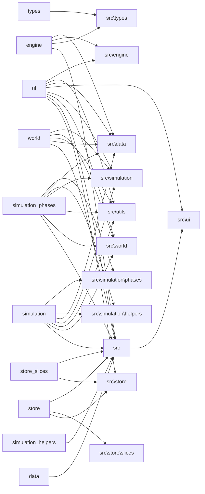

# CODEBASE — Auto-Generated Index
> Generated: 2026-05-09T02:31:31.201Z | Commit: 8c0f5decc8ec7ad41c1fcf04c967af2a5a929871 | Run: `npm run scout`

## Module Map
| Path | Exports | Lines | Test? |
|------|---------|-------|-------|
| src/data/biomes.ts | BIOME_COLORS, BIOME_GLYPHS | 31 | — |
| src/data/db.ts | SaveSlot, CascadeDatabase, db | 57 | — |
| src/data/names.ts | FACTION_TEMPLATES, NPC_NAMES, ITEM_TEMPLATES | 67 | — |
| src/data/templates.ts | DialogueTemplate, DIALOGUE, fillTemplate, AccuracyTier, getAccuracyTier | 504 | — |
| src/engine/camera.ts | createCamera, centerOnPlayer | 41 | — |
| src/engine/echoSystem.ts | executeEcho | 106 | — |
| src/engine/index.ts |  | 8 | — |
| src/engine/input.ts | GameAction, mapKeyToAction | 41 | — |
| src/engine/renderer.ts | RenderContext, renderWorld | 344 | — |
| src/engine/tileMap.test.ts |  | 120 | — |
| src/engine/tileMap.ts | SPRITE_SIZE, TileRegion, SHEET_TERRAIN, SHEET_SETTLEMENT, SHEET_CHARACTER | 109 | ✓ |
| src/main.tsx |  | 11 | — |
| src/simulation/cascade.ts | CascadeResult, CascadeTier, calculateCascade, formatChainAsTree | 68 | — |
| src/simulation/constants.ts | WAR_ANIMOSITY_THRESHOLD, FAMINE_DESERT_THRESHOLD, FAMINE_POPULATION_MIN, REBELLION_STABILITY_MIN, ALLIANCE_OPINION_MIN | 38 | — |
| src/simulation/emitEvent.ts | emitEvent | 13 | — |
| src/simulation/helpers/spatial.ts | FactionMapStats, MapOwnershipSummary, getMapOwnershipSummary, getTilesForFaction, getTilesWithPosForFaction | 116 | — |
| src/simulation/helpers/stats.ts | getFactionStat, applyStatDeltas | 35 | — |
| src/simulation/index.ts |  | 6 | — |
| src/simulation/llm.ts | LLMConfig, getLLMConfig, saveLLMConfig | 77 | — |
| src/simulation/narrative.ts | NarrativeContext, assembleNarrativeContext, buildSocraticPrompt, getTemplateDialogue | 106 | — |
| src/simulation/phases/cascade.ts | phaseCascade, deriveConsequence, cascadeTesting | 192 | — |
| src/simulation/phases/colonization.ts | phaseSettlementGrowth, phaseColonization | 143 | — |
| src/simulation/phases/conflict.ts | phaseConflict, fractureFaction | 239 | — |
| src/simulation/phases/ecology.ts | phaseEcology | 61 | — |
| src/simulation/phases/economics.ts | phaseEconomics | 64 | — |
| src/simulation/phases/interestGroups.ts | phaseInterestGroups | 45 | — |
| src/simulation/phases/knowledge.test.ts |  | 65 | — |
| src/simulation/phases/knowledge.ts | seedEventKnowledge, phaseGossip, runKnowledgePipeline | 68 | ✓ |
| src/simulation/phases/phaseTrade.ts | phaseTrade | 144 | — |
| src/simulation/phases/politics.ts | phasePolitics | 67 | — |
| src/simulation/phases/stability.ts | phaseStability | 140 | — |
| src/simulation/phases/succession.ts | getRulerForFaction, hasTrait, phaseSuccession | 96 | — |
| src/simulation/storyteller.ts | computeTension, decayTension, pruneCooldowns, shouldSuppressEvent, registerHighSigEvent | 349 | — |
| src/simulation/tick.test.ts |  | 255 | — |
| src/simulation/tick.ts | runSimulation, _forTesting | 143 | ✓ |
| src/simulation/worker.ts | SimulationMessage, SimulationResult | 50 | — |
| src/store/index.ts | useGameStore, getGameState, dispatchGameAction | 44 | — |
| src/store/slices/camera.ts | createCameraSlice | 20 | — |
| src/store/slices/config.ts | createConfigSlice | 10 | — |
| src/store/slices/ui.ts | createUISlice | 36 | — |
| src/store/slices/world.ts | createWorldSlice | 34 | — |
| src/store/types.ts | WorldSlice, CameraSlice, UISlice, ConfigSlice, GameStore | 42 | — |
| src/types/index.ts |  | 5 | — |
| src/types/simulation.ts | GameEvent, CausalChain, CausalNode | 31 | — |
| src/types/storyteller.ts | StorytellerMode, CooldownEntry, StorytellerState, defaultStorytellerState | 51 | — |
| src/types/ui.ts | DEFAULT_CONFIG, GamePhase, Camera, GameStore, TILE_SIZE | 46 | — |
| src/types/world.ts | Position, Biome, Tile, TileModifier, GameMap | 254 | — |
| src/ui/ActionMenu.tsx | ActionMenu | 144 | — |
| src/ui/App.tsx | App | 193 | — |
| src/ui/CascadeMap.tsx | CascadeMap | 127 | — |
| src/ui/CascadeScore.tsx | CascadeScore | 72 | — |
| src/ui/DialoguePanel.tsx | DialoguePanel | 284 | — |
| src/ui/GameCanvas.tsx | GameCanvas | 182 | — |
| src/ui/HUD.tsx | HUD | 79 | — |
| src/ui/KnowledgeLog.tsx | KnowledgeLog | 39 | — |
| src/ui/PixiViewport.tsx | PixiViewport | 708 | — |
| src/ui/simulationResult.test.ts |  | 74 | — |
| src/ui/simulationResult.ts | processSimulationResult | 94 | ✓ |
| src/ui/TitleScreen.tsx | TitleScreen | 149 | — |
| src/utils/noise.ts | createNoise2D, createFBM2D | 113 | — |
| src/utils/rng.ts | SeededRNG | 39 | — |
| src/world/entities.ts | generateNPCs, createPlayer, generateItems | 172 | — |
| src/world/events.ts | createEvent, buildCausalChains, resetEventIds, initEventIds | 99 | — |
| src/world/factions.ts | generateFactions, generateRelationships, computeEthicsDivergence | 249 | — |
| src/world/index.ts |  | 12 | — |
| src/world/terrain.ts | generateTerrain | 148 | — |
| src/world/worldgen.ts | generateWorld | 206 | — |

## Dependency Graph (Directory Level)


## Hub Files (Most Imported)
- src/types (38 imports)
- src/simulation/../types (14 imports)
- src/simulation/../utils/rng.ts (11 imports)
- src/utils/rng.ts (10 imports)
- src/simulation/../world/events.ts (10 imports)

## Hotspots (Size × Churn)
| File | Lines | Commits | Risk |
|------|-------|---------|------|
| src/ui/PixiViewport.tsx | 708 | 8 | 🔴 |
| src/ui/App.tsx | 193 | 18 | 🟡 |
| src/simulation/tick.ts | 143 | 17 | 🟡 |
| src/ui/DialoguePanel.tsx | 284 | 7 | 🟢 |
| src/world/worldgen.ts | 206 | 9 | 🟢 |
| src/data/templates.ts | 504 | 3 | 🟢 |
| src/engine/renderer.ts | 344 | 4 | 🟢 |
| src/ui/TitleScreen.tsx | 149 | 8 | 🟢 |
| src/ui/GameCanvas.tsx | 182 | 6 | 🟢 |
| src/simulation/storyteller.ts | 349 | 3 | 🟢 |

## Recent Changes (Last 10 Merges/Commits)
```
8c0f5de chore: finalize zustand migration, fix missing insight and tradeRoutes in tests
cc922e1 refactor(simulation): decompose tick monolith and optimize spatial queries
2214411 feat: implement title screen with storyteller mode selection and AI settings alongside playtest SOP documentation
b4d7ba3 test: increase playwright timeouts for slow-running jump/world tests
717ad43 Reorganize root clutter and consolidate src/types barrel (#14)
c826d5e Merge branch 'master' of https://github.com/shadepants/cascade
772a9f8 Potential fix for code scanning alert no. 2: Prototype-polluting assignment (#13)
1a960d6 Merge branch 'master' of https://github.com/shadepants/cascade
79cfbd8 Modularize simulation pipeline, split domain types, and centralize jump-result processing (#12)
028d2e0 Potential fix for code scanning alert no. 1: Clear text storage of sensitive information (#11)
```
