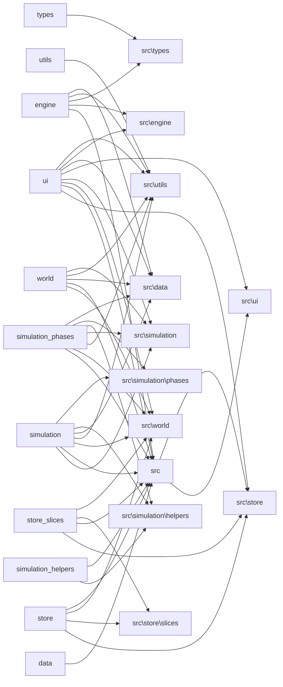

# CODEBASE — Auto-Generated Index
> Generated: 2026-06-01T06:38:26.815Z | Commit: 28a09b10ec729ecde659e45265a6899f640fe7f8 | Run: `npm run scout`

## Module Map
| Path | Exports | Lines | Test? |
|------|---------|-------|-------|
| src/data/biomes.ts | BIOME_COLORS, BIOME_GLYPHS | 31 | — |
| src/data/db.ts | SaveSlot, CascadeDatabase, db | 63 | — |
| src/data/names.ts | FACTION_TEMPLATES, NPC_NAMES, ITEM_TEMPLATES | 67 | — |
| src/data/templates.ts | DialogueTemplate, DIALOGUE, fillTemplate, AccuracyTier, getAccuracyTier | 504 | — |
| src/engine/camera.ts | createCamera, centerOnPlayer | 41 | — |
| src/engine/echoSystem.test.ts |  | 176 | — |
| src/engine/echoSystem.ts | executeEcho | 295 | ✓ |
| src/engine/ghostLayer.ts | strokeDashedEdge, updateGhostLayer | 131 | — |
| src/engine/index.ts |  | 8 | — |
| src/engine/input.ts | GameAction, mapKeyToAction | 41 | — |
| src/engine/pixiTypes.ts | Sheets, Layers, SheetKey, TextureSheetKey, CascadeSpriteMeta | 50 | — |
| src/engine/renderer.ts | RenderContext, renderWorld | 344 | — |
| src/engine/tileMap.test.ts |  | 120 | — |
| src/engine/tileMap.ts | SPRITE_SIZE, TileRegion, SHEET_TERRAIN, SHEET_SETTLEMENT, SHEET_CHARACTER | 133 | ✓ |
| src/engine/tradeLayer.ts | updateTradeLayer | 68 | — |
| src/engine/visualEffects.ts | updateVisualEffectsLayer, updateModifierLayer | 136 | — |
| src/engine/worldRenderer.ts | terrainTint, rebuildWorldSprites | 345 | — |
| src/main.tsx |  | 11 | — |
| src/simulation/cascade.test.ts |  | 95 | — |
| src/simulation/cascade.ts | CascadeResult, CascadeTier, calculateCascade, formatChainAsTree | 74 | ✓ |
| src/simulation/constants.ts | WAR_ANIMOSITY_THRESHOLD, FAMINE_DESERT_THRESHOLD, FAMINE_POPULATION_MIN, REBELLION_STABILITY_MIN, ALLIANCE_OPINION_MIN | 56 | — |
| src/simulation/emitEvent.ts | emitEvent | 13 | — |
| src/simulation/helpers/spatial.test.ts |  | 169 | — |
| src/simulation/helpers/spatial.ts | FactionMapStats, MapOwnershipSummary, getMapOwnershipSummary, getTilesForFaction, getTilesWithPosForFaction | 116 | ✓ |
| src/simulation/helpers/stats.test.ts |  | 124 | — |
| src/simulation/helpers/stats.ts | getFactionStat, applyStatDeltas | 35 | ✓ |
| src/simulation/index.ts |  | 6 | — |
| src/simulation/narrative.test.ts |  | 30 | — |
| src/simulation/narrative.ts | NarrativeContext, assembleNarrativeContext, synthesizeFutureOutlook, synthesizeHistoryMonologue, getTemplateDialogue | 280 | ✓ |
| src/simulation/phases/cascade.ts | phaseCascade, deriveConsequence, cascadeTesting | 181 | — |
| src/simulation/phases/colonization.test.ts |  | 160 | — |
| src/simulation/phases/colonization.ts | phaseSettlementGrowth, phaseColonization | 179 | ✓ |
| src/simulation/phases/conflict.test.ts |  | 295 | — |
| src/simulation/phases/conflict.ts | phaseConflict, fractureFaction | 293 | ✓ |
| src/simulation/phases/ecology.test.ts |  | 89 | — |
| src/simulation/phases/ecology.ts | phaseEcology | 61 | ✓ |
| src/simulation/phases/economics.test.ts |  | 103 | — |
| src/simulation/phases/economics.ts | phaseEconomics | 109 | ✓ |
| src/simulation/phases/interestGroups.test.ts |  | 108 | — |
| src/simulation/phases/interestGroups.ts | phaseInterestGroups | 45 | ✓ |
| src/simulation/phases/knowledge.test.ts |  | 91 | — |
| src/simulation/phases/knowledge.ts | seedEventKnowledge, phaseGossip, phaseDiffusion, runKnowledgePipeline | 122 | ✓ |
| src/simulation/phases/phaseReligion.test.ts |  | 205 | — |
| src/simulation/phases/phaseReligion.ts | phaseReligion | 324 | ✓ |
| src/simulation/phases/phaseTech.test.ts |  | 228 | — |
| src/simulation/phases/phaseTech.ts | phaseTech | 208 | ✓ |
| src/simulation/phases/phaseTrade.test.ts |  | 185 | — |
| src/simulation/phases/phaseTrade.ts | phaseTrade | 159 | ✓ |
| src/simulation/phases/politics.test.ts |  | 77 | — |
| src/simulation/phases/politics.ts | phasePolitics | 81 | ✓ |
| src/simulation/phases/stability.test.ts |  | 114 | — |
| src/simulation/phases/stability.ts | phaseStability | 156 | ✓ |
| src/simulation/phases/succession.test.ts |  | 125 | — |
| src/simulation/phases/succession.ts | getRulerForFaction, hasTrait, phaseSuccession | 104 | ✓ |
| src/simulation/storyteller.perf.test.ts |  | 103 | — |
| src/simulation/storyteller.test.ts |  | 483 | — |
| src/simulation/storyteller.ts | computeTension, decayTension, pruneCooldowns, shouldSuppressEvent, registerHighSigEvent | 426 | ✓ |
| src/simulation/tick.test.ts |  | 266 | — |
| src/simulation/tick.ts | runSimulation, _forTesting | 164 | ✓ |
| src/simulation/worker.ts | SimulationMessage, SimulationResult | 50 | — |
| src/store/index.ts | useGameStore, getGameState, dispatchGameAction | 46 | — |
| src/store/slices/camera.ts | createCameraSlice | 20 | — |
| src/store/slices/config.ts | createConfigSlice | 10 | — |
| src/store/slices/ui.ts | createUISlice | 62 | — |
| src/store/slices/world.test.ts |  | 22 | — |
| src/store/slices/world.ts | createWorldSlice | 61 | ✓ |
| src/store/types.ts | WorldSlice, CameraSlice, UISlice, ConfigSlice, GameStore | 52 | — |
| src/types/index.ts |  | 6 | — |
| src/types/simulation.ts | GameEvent, CausalChain, CausalNode | 31 | — |
| src/types/storyteller.test.ts |  | 77 | — |
| src/types/storyteller.ts | StorytellerMode, CooldownEntry, StorytellerState, defaultStorytellerState | 51 | ✓ |
| src/types/test.ts | TestAction | 12 | — |
| src/types/ui.ts | DEFAULT_CONFIG, GamePhase, Camera, GameStore, TILE_SIZE | 47 | — |
| src/types/world.ts | Position, Biome, Tile, TileModifier, GameMap | 310 | — |
| src/ui/ActionMenu.tsx | ActionMenu | 144 | — |
| src/ui/App.tsx | App | 417 | — |
| src/ui/CascadeMap.tsx | CascadeMap | 127 | — |
| src/ui/CascadeScore.tsx | CascadeScore | 72 | — |
| src/ui/DialoguePanel.tsx | DialoguePanel | 231 | — |
| src/ui/GameCanvas.tsx | GameCanvas | 182 | — |
| src/ui/GlobalLedger.tsx | GlobalLedger | 127 | — |
| src/ui/HUD.tsx | HUD | 77 | — |
| src/ui/InterventionMenu.tsx | InterventionMenu | 163 | — |
| src/ui/KnowledgeLog.tsx | KnowledgeLog | 39 | — |
| src/ui/OraclesEye.tsx | OraclesEye | 132 | — |
| src/ui/PixiViewport.tsx | PixiViewport | 524 | — |
| src/ui/simulationResult.test.ts |  | 129 | — |
| src/ui/simulationResult.ts | formatNotificationValue, processSimulationResult | 117 | ✓ |
| src/ui/TitleScreen.tsx | TitleScreen | 103 | — |
| src/utils/noise.test.ts |  | 76 | — |
| src/utils/noise.ts | createNoise2D, createFBM2D | 113 | ✓ |
| src/utils/rng.test.ts |  | 87 | — |
| src/utils/rng.ts | GameRNG, SeededRNG | 52 | ✓ |
| src/window.d.ts |  | 12 | — |
| src/world/entities.test.ts |  | 165 | — |
| src/world/entities.ts | generateNPCs, createPlayer, generateItems | 172 | ✓ |
| src/world/events.perf.test.ts |  | 43 | — |
| src/world/events.ts | createEvent, buildCausalChains, resetEventIds, initEventIds | 116 | — |
| src/world/factions.ts | generateFactions, generateRelationships, computeEthicsDivergence | 253 | — |
| src/world/index.ts |  | 12 | — |
| src/world/terrain.test.ts |  | 93 | — |
| src/world/terrain.ts | generateTerrain | 148 | ✓ |
| src/world/worldgen.test.ts |  | 47 | — |
| src/world/worldgen.ts | generateWorld | 343 | ✓ |

## Dependency Graph (Directory Level)


## Hub Files (Most Imported)
- src/types (52 imports)
- src/simulation/../types (34 imports)
- src/simulation/../utils/rng.ts (23 imports)
- src/utils/rng.ts (13 imports)
- src/simulation/storyteller.ts (13 imports)

## Hotspots (Size × Churn)
| File | Lines | Commits | Risk |
|------|-------|---------|------|
| src/ui/App.tsx | 417 | 38 | 🔴 |
| src/ui/PixiViewport.tsx | 524 | 27 | 🔴 |
| src/world/worldgen.ts | 343 | 18 | 🔴 |
| src/simulation/phases/phaseReligion.ts | 324 | 15 | 🟡 |
| src/engine/echoSystem.ts | 295 | 15 | 🟡 |
| src/simulation/phases/conflict.test.ts | 295 | 15 | 🟡 |
| src/ui/DialoguePanel.tsx | 231 | 19 | 🟡 |
| src/simulation/tick.ts | 164 | 25 | 🟡 |
| src/engine/worldRenderer.ts | 345 | 10 | 🟡 |
| src/simulation/storyteller.ts | 426 | 8 | 🟡 |

## Recent Changes (Last 10 Merges/Commits)
```
5e08098 Use spendInsight store action hook instead of getState in DialoguePanel
cd362bc Fix ESLint react-hooks/set-state-in-effect error in DialoguePanel by using a key-based reset
8fcf609 Fix unresolved comments from PR 46, resolve port conflicts, and align RNG logic
e860f0b Fix all ESLint, React hook, E2E test imports, and build errors
c5ea9f6 fix: remove redundant tauri store destructuring
31f1003 fix: address PR review thread feedback items
37c187a Fix App simulation callback regression after rebase
8e3f82a Address PR review thread feedback
2096dd9 Potential fix for pull request finding
addb2d5 Potential fix for pull request finding
```
